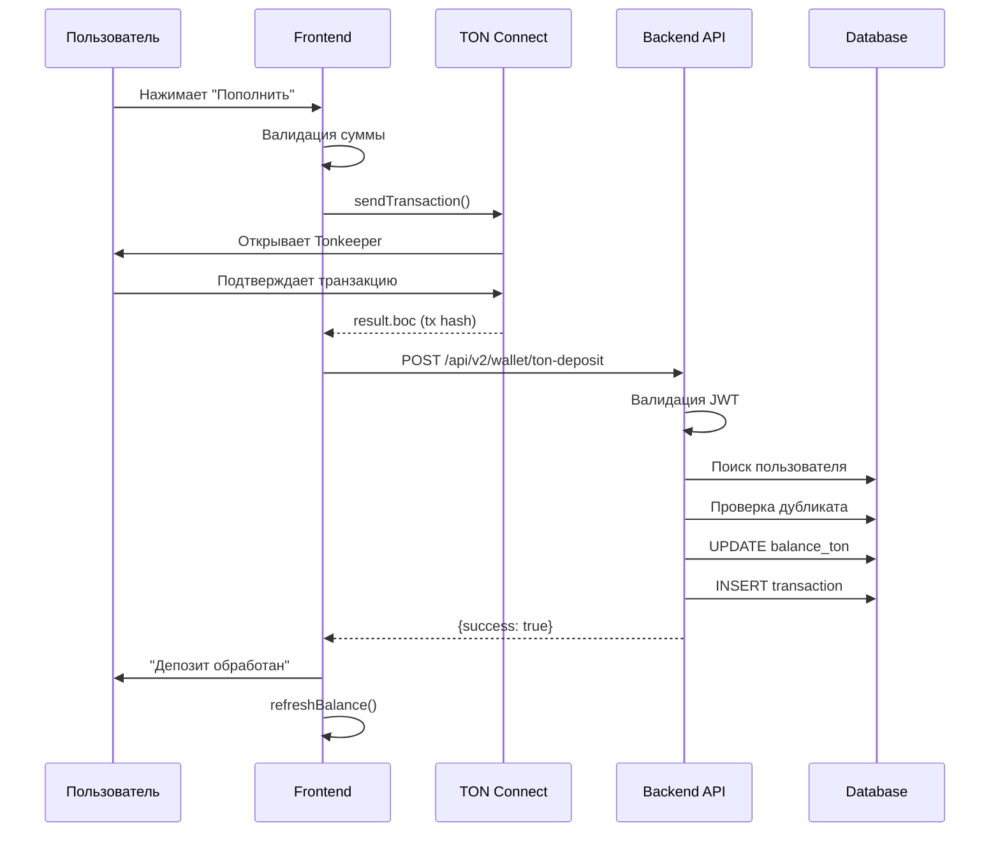

# 🔍 ПОЛНОЕ ТЕХНИЧЕСКОЕ ОПИСАНИЕ ЦЕПОЧКИ ПРИЁМА TON В UNIFARM

**Дата создания:** 21 января 2025  
**Версия системы:** 2.0  
**Статус:** ✅ Полностью функциональна и протестирована

---

## 📊 ОБЗОР АРХИТЕКТУРЫ

```
┌─────────────────┐     ┌─────────────────┐     ┌─────────────────┐     ┌─────────────────┐
│                 │     │                 │     │                 │     │                 │
│   Frontend      │────▶│  TON Connect    │────▶│    Backend      │────▶│    Database     │
│ (TonDepositCard)│     │  (Blockchain)   │     │   (API/Service) │     │   (Supabase)    │
│                 │     │                 │     │                 │     │                 │
└─────────────────┘     └─────────────────┘     └─────────────────┘     └─────────────────┘
```

---

## 🧩 1. FRONTEND - ИНИЦИАЦИЯ ДЕПОЗИТА

### 1.1 Точка входа пользователя
**Компонент:** `client/src/components/wallet/TonDepositCard.tsx`  
**Экран:** Раздел "Кошелек" → Карточка "Пополнение через TON Wallet"

### 1.2 Процесс подключения кошелька

```typescript
// Проверка подключения при загрузке компонента
useEffect(() => {
  if (tonConnectUI) {
    const connected = isTonWalletConnected(tonConnectUI);
    setIsConnected(connected);
    
    if (connected && tonConnectUI.account?.address) {
      const getUserFriendlyAddress = async () => {
        const userFriendlyAddress = await getTonWalletAddress(tonConnectUI);
        if (userFriendlyAddress) {
          setWalletAddress(userFriendlyAddress);
          await saveTonWalletAddress(userFriendlyAddress); // Сохранение в БД
        }
      };
      getUserFriendlyAddress();
    }
  }
}, [tonConnectUI]);
```

**Используемые хуки и функции:**
- `useTonConnectUI()` - React hook для доступа к TonConnect UI
- `isTonWalletConnected()` - проверка статуса подключения
- `getTonWalletAddress()` - получение user-friendly адреса
- `saveTonWalletAddress()` - сохранение адреса в БД через API

### 1.3 Генерация транзакции и отправка

**Обработчик депозита (строки 95-156):**

```typescript
const handleDeposit = async () => {
  const depositAmount = parseFloat(amount);
  
  // Валидация
  if (!depositAmount || depositAmount <= 0) {
    showError('Введите корректную сумму');
    return;
  }

  // Отправка транзакции через TON Connect
  const result = await sendTonTransaction(
    tonConnectUI,
    depositAmount.toString(),
    'UniFarm Deposit'
  );

  if (result && result.status === 'success' && result.txHash) {
    // Уведомление backend о транзакции
    const response = await fetch('/api/v2/wallet/ton-deposit', {
      method: 'POST',
      headers: {
        'Content-Type': 'application/json',
        'Authorization': `Bearer ${localStorage.getItem('unifarm_jwt_token')}`
      },
      body: JSON.stringify({
        user_id: userId,
        ton_tx_hash: result.txHash,
        amount: depositAmount,
        wallet_address: walletAddress
      })
    });
  }
};
```

### 1.4 Параметры, отправляемые с фронтенда

| Параметр | Тип | Описание | Источник |
|----------|-----|----------|----------|
| `user_id` | number | ID пользователя в системе | Из UserContext |
| `ton_tx_hash` | string | Хеш транзакции в блокчейне | result.boc из TonConnect |
| `amount` | number | Сумма в TON | Введенная пользователем |
| `wallet_address` | string | Адрес отправителя | Из TonConnect UI |

---

## 🔗 2. TON CONNECT - БЛОКЧЕЙН ИНТЕГРАЦИЯ

### 2.1 Сервис TON Connect
**Файл:** `client/src/services/tonConnectService.ts`

### 2.2 Процесс отправки транзакции

```typescript
export async function sendTonTransaction(
  tonConnectUI: TonConnectUI,
  tonAmount: string,
  comment: string = ''
): Promise<{ txHash: string; status: string } | null> {
  // Конвертация в наноTON
  const nanoTonAmount = parseFloat(tonAmount) * 1000000000;
  
  // Получение адреса получателя из ENV
  const receiverAddress = import.meta.env.VITE_TON_BOOST_RECEIVER_ADDRESS || 
    'UQBlrUfJMIlAcyYzttyxV2xrrvaHHIKEKeetGZbDoitTRWT8';
  
  // Формирование payload с комментарием
  const payload = createTONPayload(comment);
  
  // Параметры транзакции
  const transaction = {
    validUntil: Math.floor(Date.now() / 1000) + 600, // 10 минут
    messages: [{
      address: receiverAddress,
      amount: nanoTonAmount.toString(),
      payload: payload,
      bounce: false
    }]
  };
  
  // Отправка через TonConnect UI
  const result = await tonConnectUI.sendTransaction(transaction);
  
  return {
    txHash: result.boc,
    status: 'success'
  };
}
```

### 2.3 Поддерживаемые кошельки
- Tonkeeper
- OpenMask
- TonHub
- И другие кошельки, поддерживающие протокол TON Connect

---

## 🖥️ 3. BACKEND - ОБРАБОТКА ДЕПОЗИТА

### 3.1 Маршрутизация
**Файл:** `modules/wallet/routes.ts`

```typescript
// Регистрация маршрута (строка 82)
router.post('/ton-deposit', 
  requireTelegramAuth,    // Проверка JWT токена
  liberalRateLimit,       // Rate limiting
  validateBody(tonDepositSchema), // Валидация данных
  walletController.tonDeposit.bind(walletController)
);

// Схема валидации
const tonDepositSchema = z.object({
  ton_tx_hash: z.string().min(1, 'Transaction hash is required'),
  amount: z.number().positive('Amount must be positive'),  
  wallet_address: z.string().min(1, 'Wallet address is required')
});
```

### 3.2 Контроллер
**Файл:** `modules/wallet/controller.ts` (метод `tonDeposit`)

#### Архитектурное решение: Wallet-Based Deposit Resolution

```typescript
async tonDeposit(req: Request, res: Response, next: NextFunction) {
  const telegram = this.validateTelegramAuth(req, res);
  const { ton_tx_hash, amount, wallet_address } = req.body;

  // 1. Поиск пользователя по JWT (стандартный flow)
  let user = await userRepository.getUserByTelegramId(telegram.user.id);
  
  // 2. Если не найден - поиск по кошельку
  if (!user) {
    const { data: existingUser } = await supabase
      .from('users')
      .select('*')
      .eq('ton_wallet_address', wallet_address)
      .single();
    
    if (existingUser) {
      user = existingUser;
    }
  }
  
  // 3. Если все еще не найден - создание нового пользователя
  if (!user) {
    user = await userRepository.getOrCreateUserFromTelegram({
      telegram_id: telegram.user.id,
      username: telegram.user.username,
      first_name: telegram.user.first_name
    });
    
    // Привязка кошелька
    await supabase
      .from('users')
      .update({
        ton_wallet_address: wallet_address,
        ton_wallet_verified: true,
        ton_wallet_linked_at: new Date().toISOString()
      })
      .eq('id', user.id);
  }
  
  // Вызов сервиса для обработки
  const result = await walletService.processTonDeposit({
    user_id: user.id,
    ton_tx_hash,
    amount,
    wallet_address
  });
}
```

### 3.3 Сервис обработки
**Файл:** `modules/wallet/service.ts` (метод `processTonDeposit`)

```typescript
async processTonDeposit(params: {
  user_id: number;
  ton_tx_hash: string;
  amount: number;
  wallet_address: string;
}): Promise<{ success: boolean; transaction_id?: string; error?: string }> {
  // 1. Проверка дублирования
  const existingTransaction = await supabase
    .from('transactions')
    .select('*')
    .eq('metadata->tx_hash', ton_tx_hash)
    .eq('type', 'DEPOSIT')
    .single();

  if (existingTransaction.data) {
    return {
      success: false,
      error: 'Этот депозит уже был обработан'
    };
  }

  // 2. Получение текущего баланса
  const { data: user } = await supabase
    .from('users')
    .select('balance_ton')
    .eq('id', user_id)
    .single();

  // 3. Обновление баланса
  const newBalance = parseFloat(user.balance_ton || '0') + amount;
  
  await supabase
    .from('users')
    .update({ balance_ton: newBalance })
    .eq('id', user_id);

  // 4. Создание записи транзакции
  const { data: transaction } = await supabase
    .from('transactions')
    .insert({
      user_id,
      amount_ton: amount,
      amount_uni: 0,
      type: 'DEPOSIT',
      currency: 'TON',
      status: 'completed',
      description: `TON deposit from blockchain: ${ton_tx_hash}`,
      metadata: {
        source: 'ton_deposit',
        original_type: 'TON_DEPOSIT',
        wallet_address,
        tx_hash: ton_tx_hash
      }
    })
    .select()
    .single();

  return {
    success: true,
    transaction_id: transaction?.id?.toString()
  };
}
```

---

## 💾 4. DATABASE - СТРУКТУРА ДАННЫХ

### 4.1 Таблица `users`

| Поле | Тип | Описание |
|------|-----|----------|
| `id` | serial | Primary key |
| `telegram_id` | bigint | Telegram ID пользователя |
| `balance_ton` | numeric(18,6) | Баланс в TON |
| `ton_wallet_address` | text | Адрес TON кошелька |
| `ton_wallet_verified` | boolean | Флаг верификации кошелька |
| `ton_wallet_linked_at` | timestamp | Время привязки кошелька |

### 4.2 Таблица `transactions` (новый формат)

| Поле | Тип | Описание |
|------|-----|----------|
| `id` | serial | Primary key |
| `user_id` | integer | FK to users |
| `amount_ton` | numeric(18,6) | Сумма в TON |
| `amount_uni` | numeric(18,6) | Сумма в UNI |
| `type` | text | Тип транзакции ('DEPOSIT') |
| `currency` | text | Валюта ('TON') |
| `status` | text | Статус ('completed') |
| `description` | text | Описание транзакции |
| `metadata` | jsonb | Дополнительные данные |
| `created_at` | timestamp | Время создания |

### 4.3 Структура metadata для TON депозитов

```json
{
  "source": "ton_deposit",
  "original_type": "TON_DEPOSIT",
  "wallet_address": "UQxx...xxx",
  "tx_hash": "hash_from_blockchain"
}
```

---

## 🔍 5. МЕХАНИЗМЫ ЗАЩИТЫ И ВАЛИДАЦИИ

### 5.1 Защита от дублирования

```sql
-- Проверка по хешу транзакции в metadata
SELECT * FROM transactions 
WHERE metadata->>'tx_hash' = 'incoming_hash' 
AND type = 'DEPOSIT'
```

### 5.2 Идентификация пользователя (приоритет)

1. **JWT токен** → telegram_id → поиск в БД
2. **Адрес кошелька** → ton_wallet_address → поиск в БД  
3. **Автосоздание** → новый пользователь + привязка кошелька

### 5.3 Обновление баланса

- **Моментальное** - сразу после получения callback от фронтенда
- **Атомарное** - в рамках одной транзакции БД
- **С откатом** - при ошибке создания записи транзакции

---

## 📈 6. FLOW DIAGRAM



---

## ⚡ 7. ПРОИЗВОДИТЕЛЬНОСТЬ И ОПТИМИЗАЦИЯ

### 7.1 Индексы в БД

```sql
-- Индексы для быстрого поиска
CREATE INDEX idx_users_ton_wallet_address ON users(ton_wallet_address);
CREATE INDEX idx_transactions_metadata_tx_hash ON transactions((metadata->>'tx_hash'));
CREATE INDEX idx_transactions_user_id ON transactions(user_id);
```

### 7.2 Rate Limiting

- Используется `liberalRateLimit` для endpoint'а
- Защита от спама запросов

### 7.3 Кеширование

- Баланс кешируется на фронтенде
- Принудительное обновление через `refreshBalance(true)`

---

## 🚨 8. ВОЗМОЖНЫЕ ПРОБЛЕМЫ И РЕШЕНИЯ

### 8.1 Транзакция прошла, но баланс не обновился

**Причины:**
1. JWT токен невалидный
2. Пользователь не найден по telegram_id
3. Ошибка сети между frontend и backend

**Решение:** Система использует wallet-based resolution - найдет пользователя по адресу кошелька

### 8.2 Дублирование депозитов

**Защита:** Проверка уникальности по `metadata->>'tx_hash'`

### 8.3 Несоответствие userId

**Решение:** Трехуровневая система поиска пользователя

---

## ✅ 9. ТЕКУЩИЙ СТАТУС СИСТЕМЫ

По результатам анализа от 21 января 2025:

- ✅ **Frontend** - полностью интегрирован с backend
- ✅ **Backend** - обрабатывает депозиты корректно
- ✅ **Database** - использует новую структуру с metadata
- ✅ **Защита** - реализована от дублирования
- ✅ **Баланс** - обновляется моментально

---

## 📝 10. РЕКОМЕНДАЦИИ ПО УЛУЧШЕНИЮ

1. **Добавить webhook от блокчейна** - для подтверждения транзакций
2. **Реализовать retry механизм** - при сбоях сети
3. **Добавить нотификации** - push уведомления о зачислении
4. **Логирование** - расширить для всех этапов процесса
5. **Мониторинг** - добавить метрики успешности депозитов

---

**Документ подготовлен:** 21 января 2025  
**Автор:** UniFarm Development Team